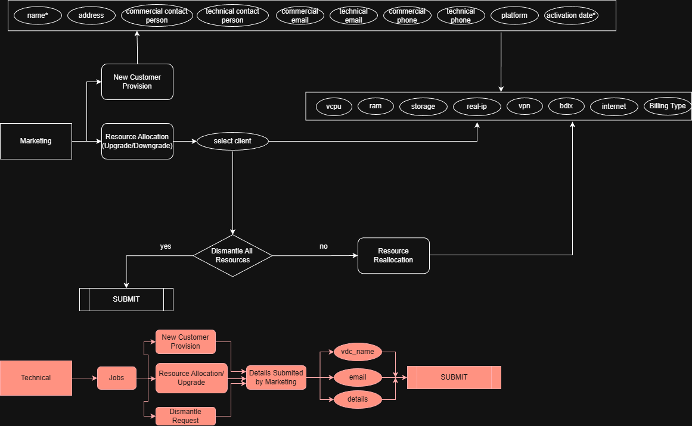

git clone https://github.com/AfifRayhan/Mir-Cloud-User-And-Client-Management-System.git

cd Mir-Cloud-User-And-Client-Management-System

composer install

cp .env.example .env

DB_CONNECTION=mysql
DB_HOST=127.0.0.1
DB_PORT=3306
DB_DATABASE=mir_cloud
DB_USERNAME=root
DB_PASSWORD=

php artisan key:generate

DB_DATABASE=mir_cloud

php artisan migrate --seed

npm run build

php artisan serve

## System Diagram

